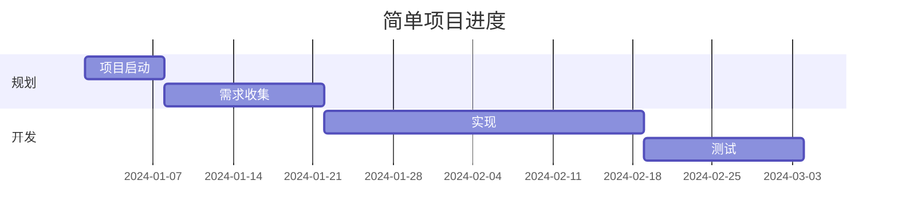
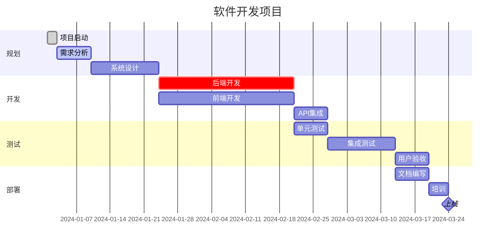
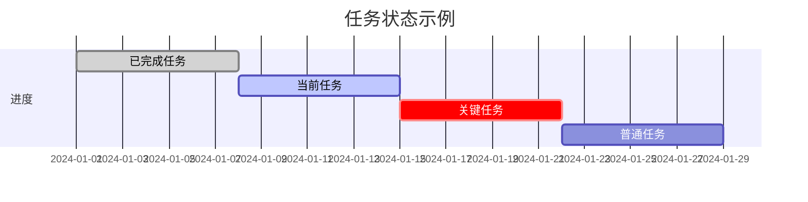
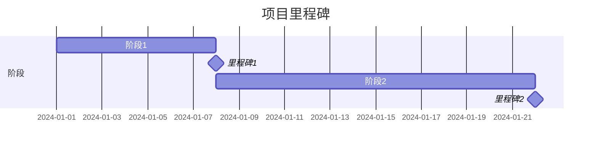
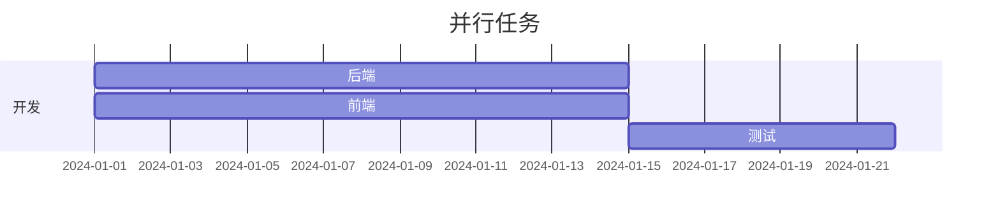

# 甘特图

甘特图用于项目规划和进度安排。它们可以显示任务、持续时间和依赖关系。

## 语法

### 基本元素
- 标题: `title [图表标题]`
- 日期格式: `dateFormat YYYY-MM-DD`
- 部分: `section [部分名称]`
- 任务: `[任务名称] : [任务ID], [开始日期], [持续时间]`
- 依赖关系: `after [任务ID]`

### 时间单位
- 分钟: `1m`
- 小时: `1h`
- 天: `1d`
- 周: `1w`
- 月: `1M`

## 基础示例

## 高级示例

## 任务状态

你可以用不同状态标记任务：
- `done` - 已完成的任务
- `active` - 当前活动的任务
- `crit` - 关键任务

## 附加功能

### 里程碑

里程碑是持续时间为零的任务：

### 并行任务

如果任务没有依赖关系，可以并行运行：

## 样式设置

外观可以通过以下方式自定义：
- 不同的任务状态（done, active, crit）
- 里程碑
- 分组部分
- 任务之间的依赖关系

## 实用技巧
- 保持任务名称简洁但描述性强
- 使用有意义的部分名称
- 显示关键依赖关系
- 包含重要的里程碑
- 将相关任务分组到部分中

## 常见问题解决

1. **布局问题**
   - 减少任务数量
   - 使用合适的时间单位
   - 适当分组任务

2. **依赖关系问题**
   - 确保依赖关系正确
   - 避免循环依赖
   - 检查任务ID唯一性

## 最佳实践
- 将大型项目分解为可管理的任务
- 使用一致的命名约定
- 定期更新进度状态
- 突出显示关键路径
- 保持图表简洁清晰

## 下一步
- [用户旅程图](/zh/diagrams/user-journey)
- [饼图](/zh/diagrams/pie)
- [Git图](/zh/diagrams/git) 