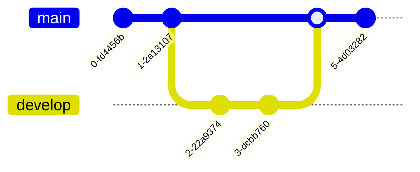
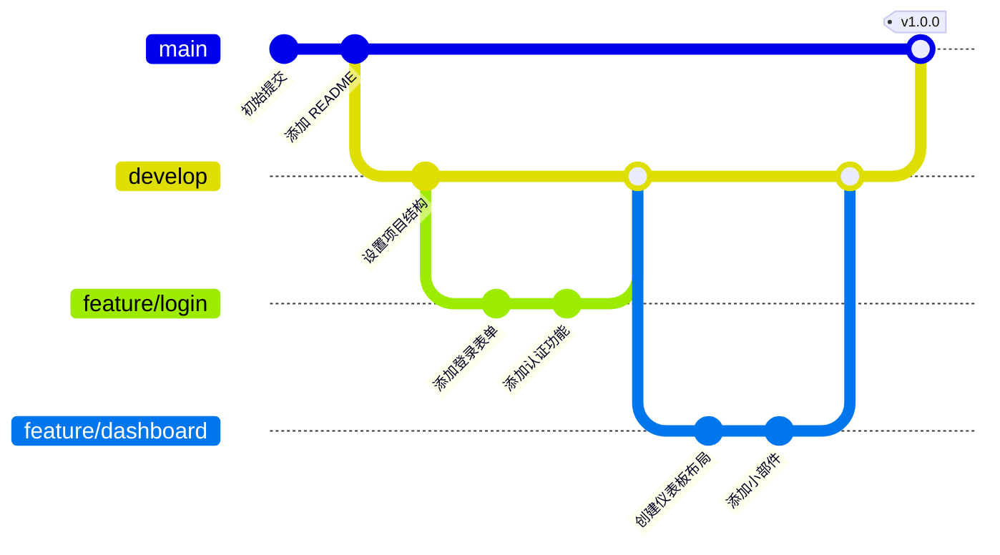
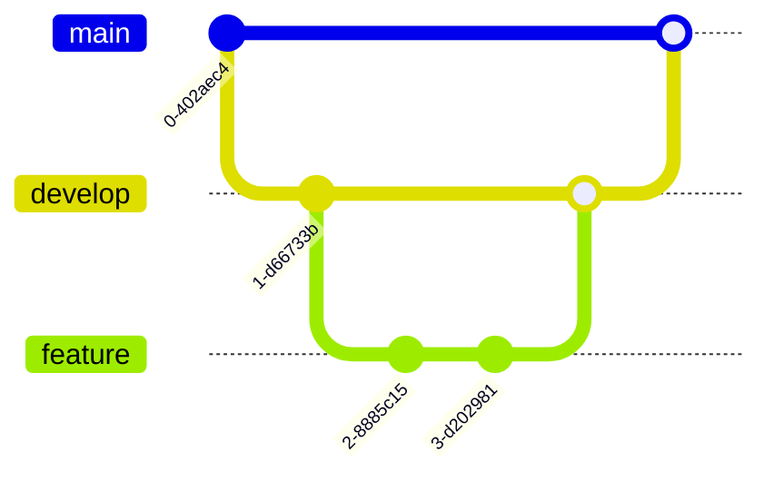
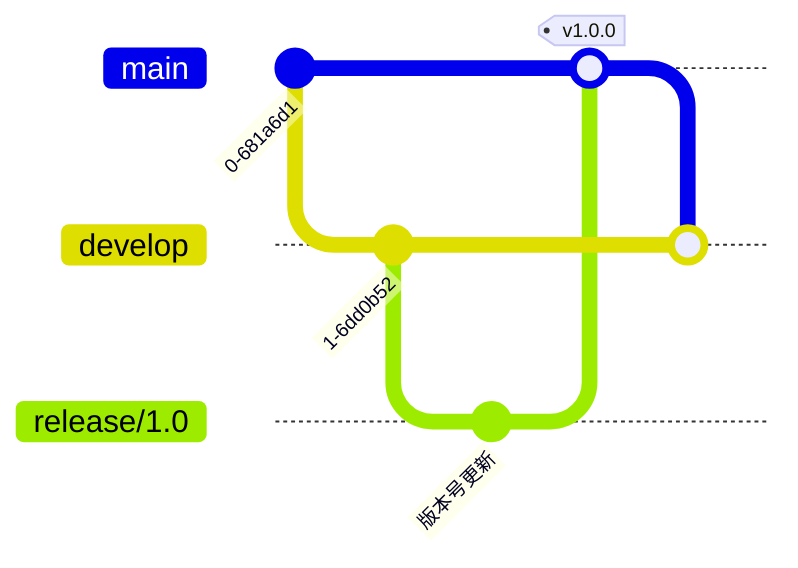
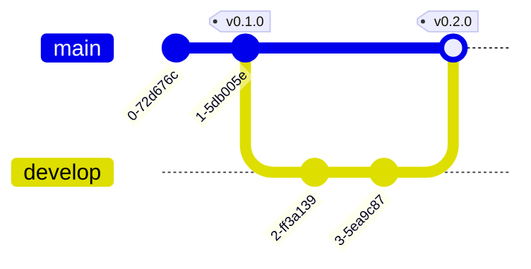
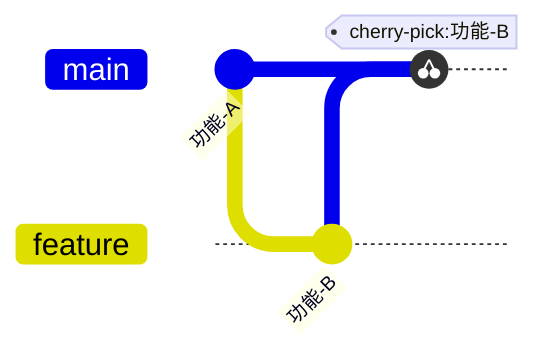

# Git 图

Git 图用于可视化 Git 仓库的历史记录，展示提交、分支和合并的关系，使其清晰易懂。

## 语法

### 基本元素
- 提交: `commit id: "消息"`
- 分支: `branch [名称]`
- 检出: `checkout [分支]`
- 合并: `merge [分支]`
- 挑选: `cherry-pick [id]`

## 基础示例

## 高级示例

这是一个展示特性开发工作流的更复杂 Git 图：

## 分支管理

## 发布管理

## 附加功能

### 标签和发布

### 提交挑选

## 样式设置

Git 图会自动：
- 显示提交历史
- 显示分支名称
- 标记合并点
- 显示标签和发布
- 为不同分支使用不同颜色

## 实用技巧
- 保持提交消息清晰简洁
- 使用有意义的分支名称
- 显示重要的标签和发布
- 包含重要的合并
- 展示分支策略
- 保持图表简单易读
- 使用一致的分支命名规范
- 在需要时包含相关的提交 ID

## 常见问题解决

1. **分支问题**
   - 避免过多的分支
   - 及时合并或删除不需要的分支
   - 保持分支结构清晰

2. **可读性问题**
   - 使用简洁的提交消息
   - 适当使用标签标记重要节点
   - 避免过于复杂的合并关系

3. **工作流问题**
   - 遵循一致的分支策略
   - 明确的合并流程
   - 适当使用标签管理版本

## 最佳实践
- 遵循 Git Flow 或类似的工作流
- 使用清晰的提交消息
- 适时创建发布标签
- 保持主分支稳定
- 及时合并特性分支
- 使用有意义的分支名称
- 定期清理过时分支

## 下一步
- [C4架构图](/zh/diagrams/c4)
- [思维导图](/zh/diagrams/mindmap)
- [时间线](/zh/diagrams/timeline) 