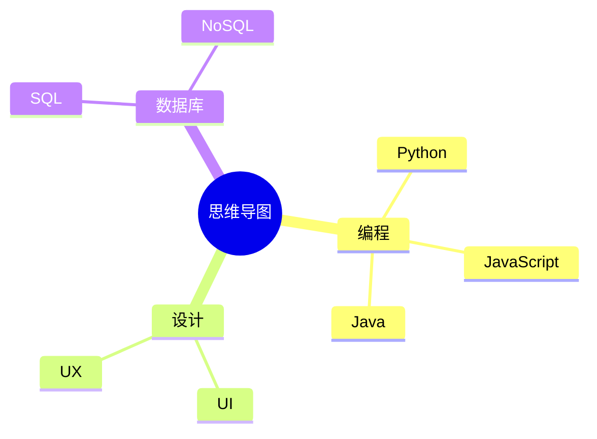
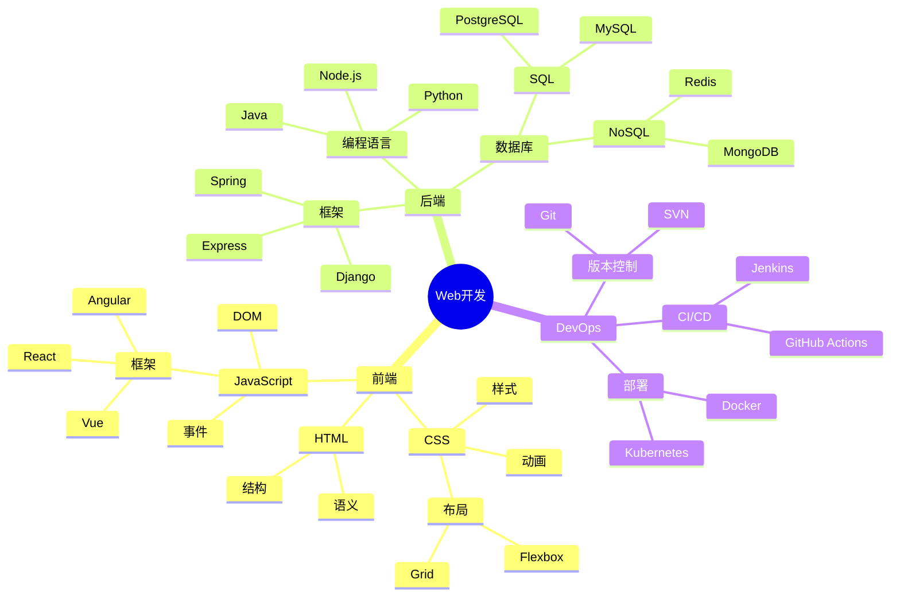
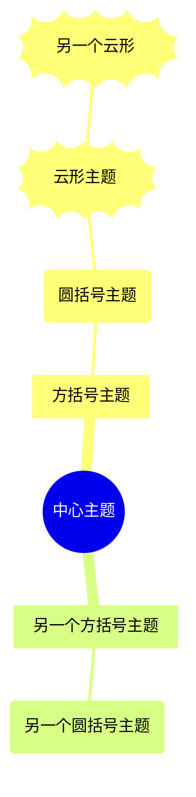
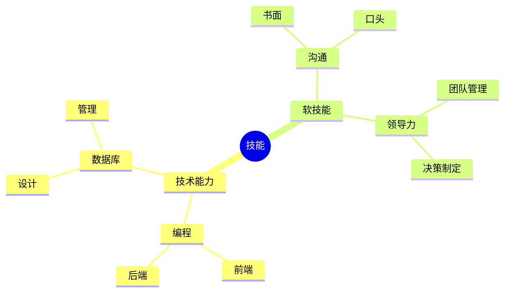

# 思维导图

思维导图是用于以层次结构方式直观组织信息的图表。它们非常适合用于头脑风暴、笔记记录和组织复杂的想法。

## 语法

### 基本元素
- 根节点：中心思想
- 分支：主要主题和子主题
- 方括号：使用 `[文本]` 进行格式化
- 圆括号：使用 `(文本)` 进行格式化

## 基本示例



## 高级示例

这是一个更详细的Web开发项目思维导图：



## 格式化选项

### 形状和样式



### 图标和标记

```mermaid
mindmap
    root((项目规划))
        [优先任务]::icon(fa fa-star)
            任务1
            任务2
        [时间线]::icon(fa fa-calendar)
            第1周
            第2周
        [资源]::icon(fa fa-users)
            团队A
            团队B
```

## 其他功能

### 多层级



## 样式

思维导图会自动：
- 居中根节点
- 层次化排列分支
- 为节点使用不同形状
- 应用一致的间距
- 清晰显示关系

## 使用技巧
- 从清晰的中心思想开始
- 使用简洁的标签
- 将相关概念组织在一起
- 限制分支的深度
- 使用一致的格式
- 保持结构平衡
- 使用形状添加视觉层次
- 关注关键关系
- 使用有意义的分组

## 常见问题解决

1. **结构问题**
   - 避免过多分支
   - 控制层级深度
   - 保持逻辑清晰

2. **可读性问题**
   - 使用简短的文本
   - 适当使用图标
   - 注意节点间距

3. **布局问题**
   - 平衡各个分支
   - 调整节点位置
   - 优化空间利用

## 最佳实践
- 从中心主题开始
- 使用关键词
- 保持层次分明
- 注意逻辑关系
- 适当使用颜色
- 定期回顾和更新
- 考虑受众需求

## 下一步
- [流程图](/zh/diagrams/flowchart)
- [时序图](/zh/diagrams/sequence)
- [甘特图](/zh/diagrams/gantt) 