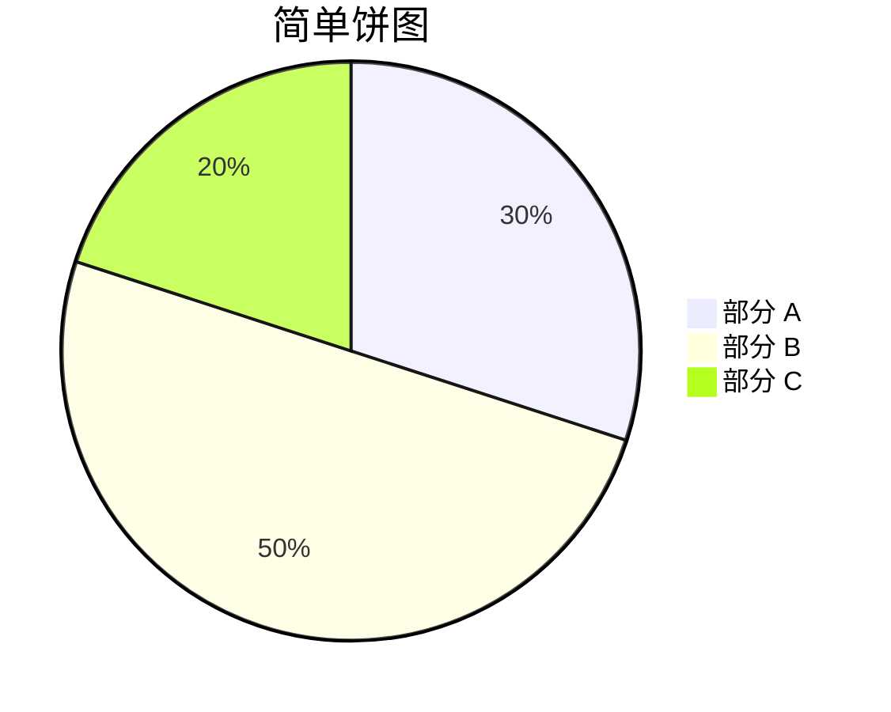
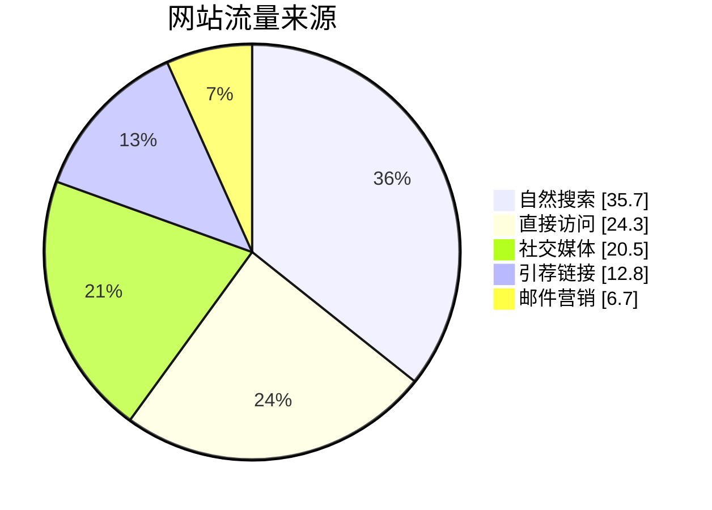
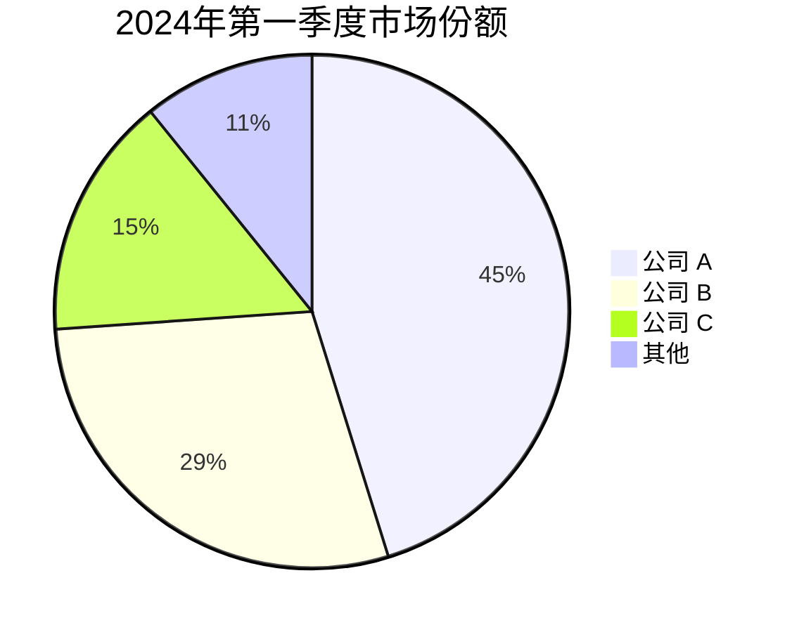
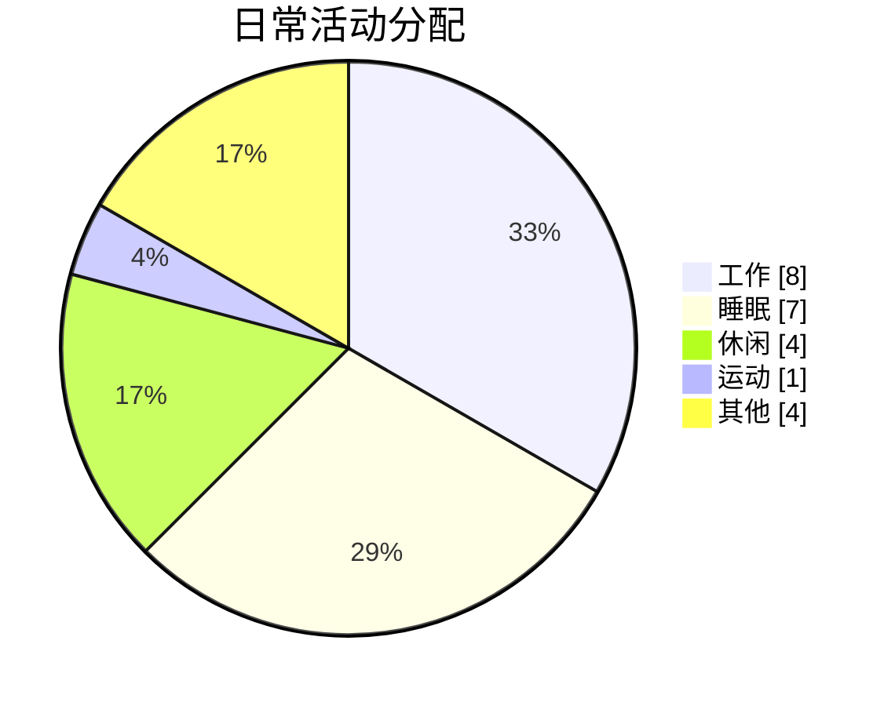
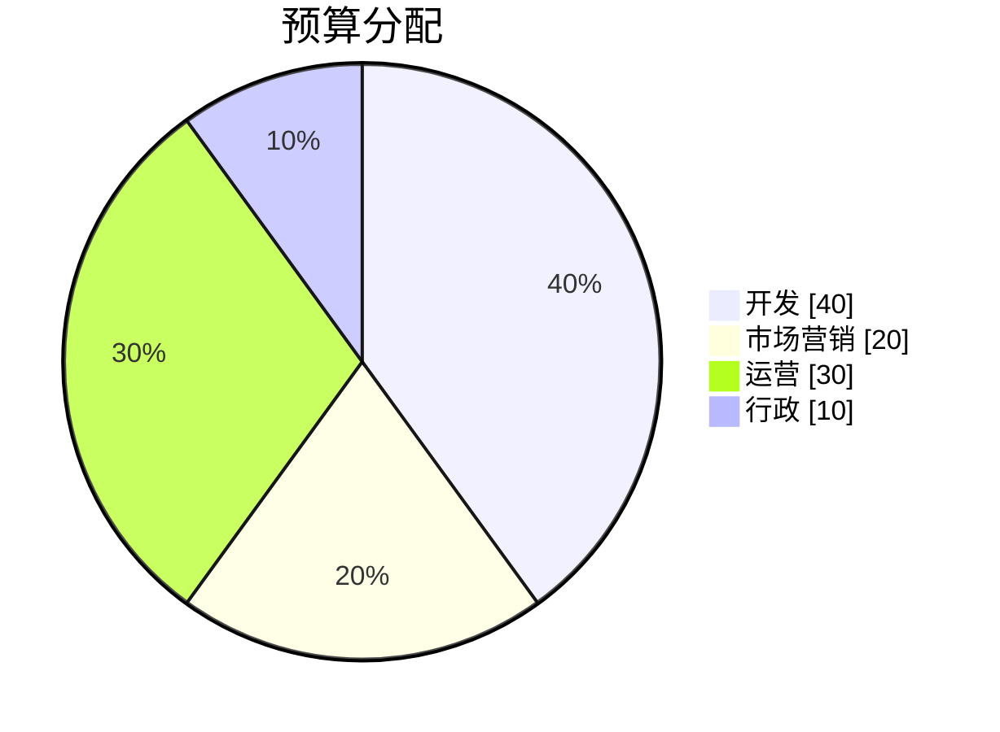

# 饼图

饼图是用于显示数值比例的圆形统计图表，通过将圆分成不同比例的扇形来展示数据。

## 语法

### 基本元素
- 标题: `pie title [图表标题]`
- 数据项: `"[标签]" : [数值]`
- 可选: `showData` - 显示具体数值

## 基础示例

## 高级示例

这是一个展示网站流量来源的详细饼图：

## 数据可视化

### 市场份额示例

### 时间分配

## 功能特点

### 显示数据值

可以使用 `showData` 显示实际数值：

## 样式设置

饼图会自动：
- 为扇形分配不同颜色
- 计算比例
- 显示标签
- 显示百分比和/或数值（使用 showData 时）

## 实用技巧
- 控制扇形数量（建议不超过7个）
- 使用清晰简洁的标签
- 考虑按大小排序扇形
- 使用有意义的标题
- 当数值重要时添加 `showData`
- 确保数值总和有意义
- 使用统一的小数位数

## 常见问题解决

1. **可读性问题**
   - 避免过多的扇形
   - 使用清晰的标签
   - 确保颜色对比适当

2. **数据问题**
   - 验证数值总和
   - 检查比例计算
   - 确保数据格式正确

3. **显示问题**
   - 调整标签位置
   - 优化颜色选择
   - 处理重叠问题

## 最佳实践
- 数据要简洁明了
- 颜色要有明显区分
- 标签要易于理解
- 比例要准确合理
- 总和要有实际意义
- 排序要有逻辑性
- 图例要清晰可见

## 下一步
- [需求图](/zh/diagrams/requirement)
- [Git图](/zh/diagrams/git)
- [C4架构图](/zh/diagrams/c4) 