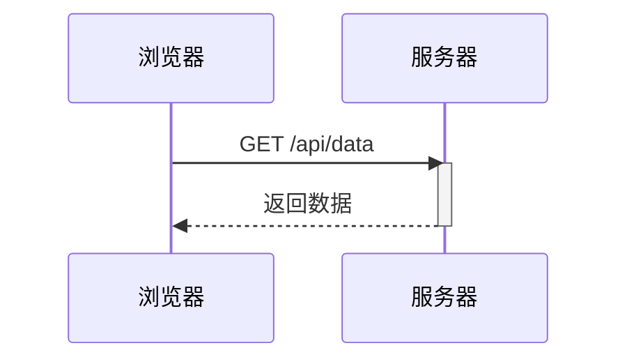
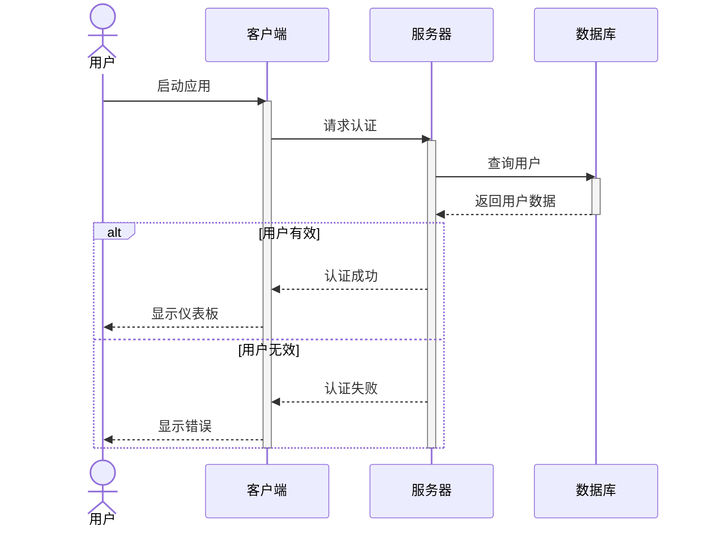
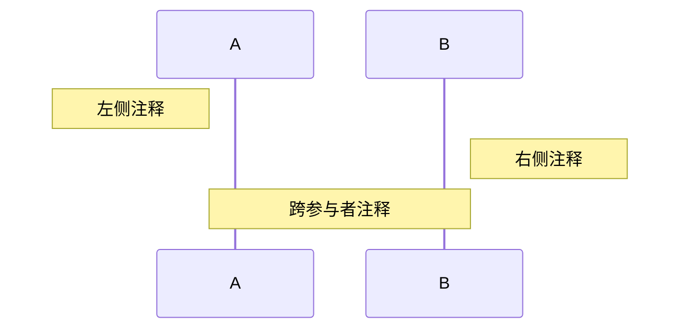
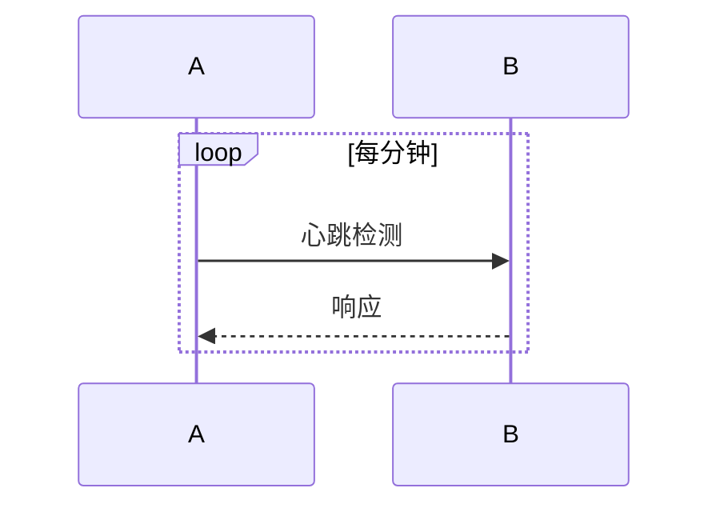

# 时序图

时序图用于展示进程之间如何操作，以及操作的顺序。它们非常适合用来记录系统交互过程。

## 语法

### 基本元素
- 参与者: `participant A` 或 `actor A`
- 消息: 
  - 实线: `->` 
  - 虚线: `-->`
  - 实线带箭头: `->>` 
  - 虚线带箭头: `-->>`
- 激活框: `activate` 和 `deactivate`
- 注释: `Note left of`, `Note right of`, `Note over`
- 循环: `loop [文本]`
- 条件分支: `alt [文本]` 和 `else [文本]`
- 可选路径: `opt [文本]`
- 并行路径: `par [文本]`

## 基础示例

## 高级示例

这是一个展示各种特性的复杂时序图：

## 附加功能

### 注释

### 循环

## 样式设置

你可以使用这些指令来自定义外观：
- `autonumber` - 自动为消息编号
- `participant A as "显示名称"` - 使用别名
- 可以通过 CSS 应用颜色和其他样式

## 实用技巧
- 保持图表聚焦于关键交互
- 使用清晰简洁的消息描述
- 使用循环或 alt/opt 块来分组相关交互
- 添加注释来解释复杂的交互
- 考虑使用别名来简化长参与者名称

## 常见问题解决

1. **布局问题**
   - 减少参与者数量
   - 使用注释代替过长的消息
   - 适当使用分组来组织消息

2. **可读性问题**
   - 使用有意义的参与者名称
   - 保持消息描述简洁
   - 适当使用空间和分组

3. **复杂性管理**
   - 将复杂交互分解为多个图
   - 使用注释说明关键点
   - 使用合适的分组机制

## 下一步
- [类图](/zh/diagrams/class)
- [状态图](/zh/diagrams/state)
- [实体关系图](/zh/diagrams/er) 