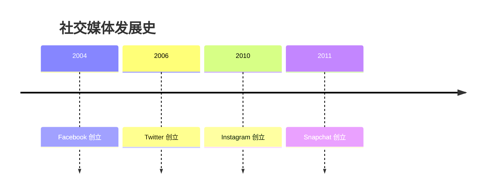
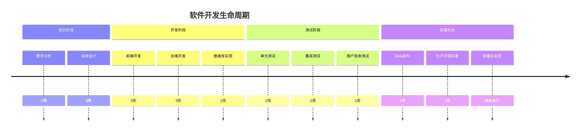
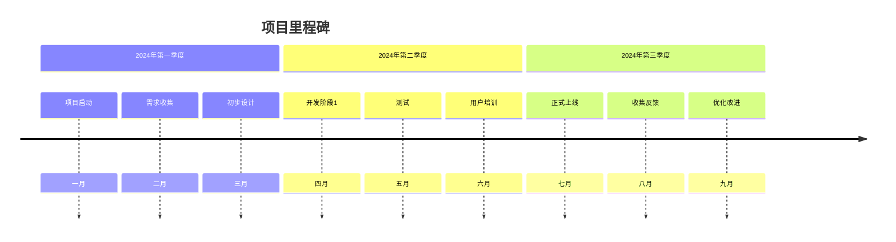
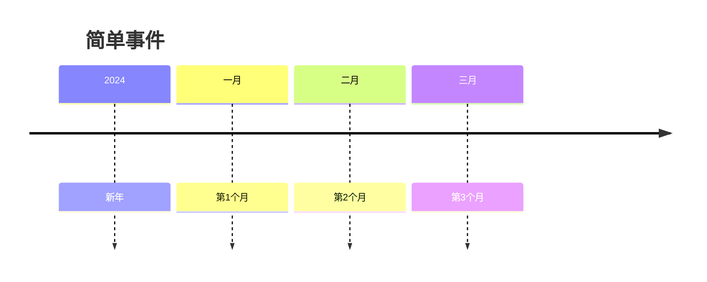
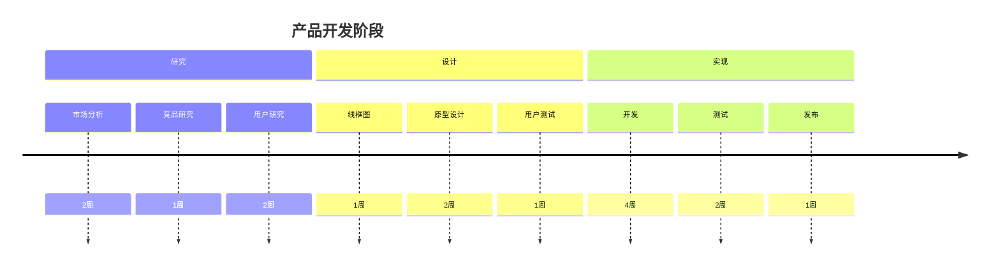

# 时间线

时间线图用于可视化按时间顺序排列的事件序列。它们非常适合用于项目规划、历史事件展示和流程文档记录。

## 语法

### 基本元素
- 标题: 可选的时间线标题
- 部分: 将事件分组
- 事件: 单个时间线条目

## 基础示例

## 高级示例

这是一个展示软件开发生命周期的详细时间线：

## 项目时间线

## 事件类型

### 简单事件

### 分组事件

## 样式设置

时间线会自动：
- 按时间顺序排列事件
- 将相关事件分组到部分中
- 显示持续时间（如指定）
- 保持一致的间距
- 显示清晰的关系

## 实用技巧
- 保持事件描述简洁
- 使用有意义的部分名称
- 包含重要日期
- 将相关事件分组
- 显示清晰的进展
- 适当包含持续时间
- 使用一致的格式
- 关注关键里程碑

## 常见问题解决

1. **结构问题**
   - 确保部分逻辑合理
   - 事件顺序正确
   - 时间跨度适当

2. **可读性问题**
   - 使用简洁的描述
   - 避免过多部分
   - 保持事件数量合理

3. **时间管理问题**
   - 合理安排时间跨度
   - 注意事件间隔
   - 处理并行事件

## 最佳实践

1. **时间线规划**
   - 确定合适的时间范围
   - 选择适当的详细程度
   - 保持时间流动清晰

2. **内容组织**
   - 使用清晰的事件描述
   - 合理分组相关事件
   - 突出重要里程碑

3. **视觉呈现**
   - 保持布局整洁
   - 使用一致的格式
   - 确保信息易读

## 下一步
- [思维导图](/zh/diagrams/mindmap)
- [甘特图](/zh/diagrams/gantt)
- [Git图](/zh/diagrams/git) 