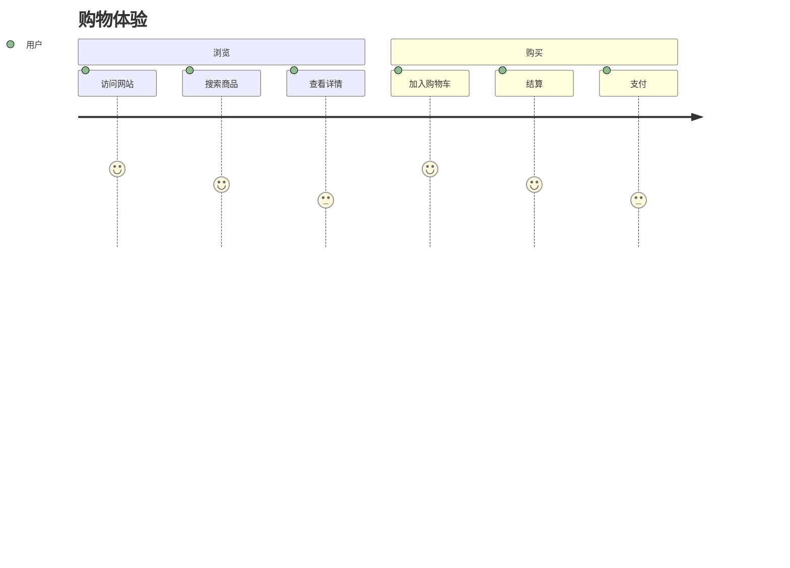
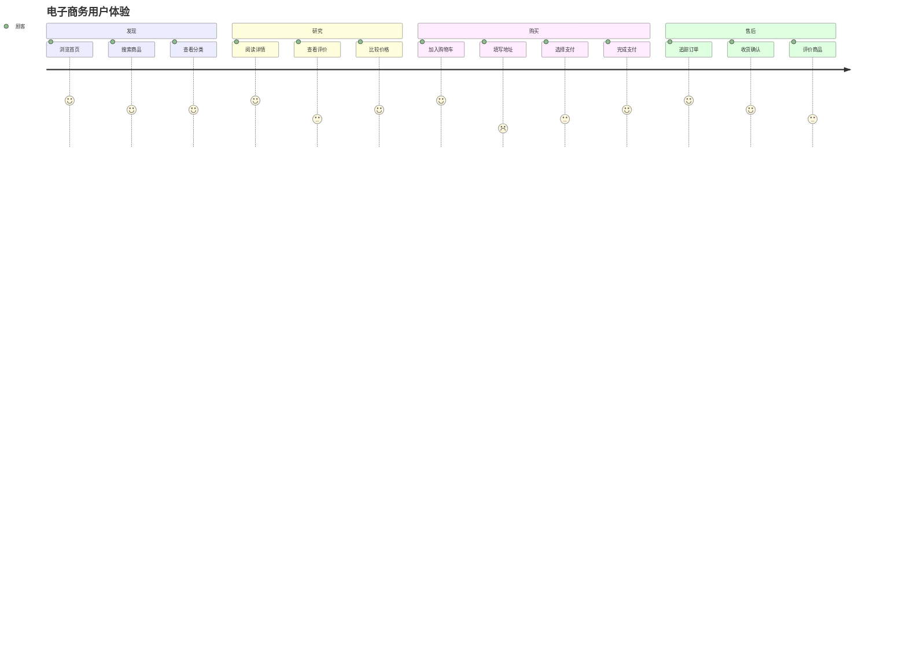
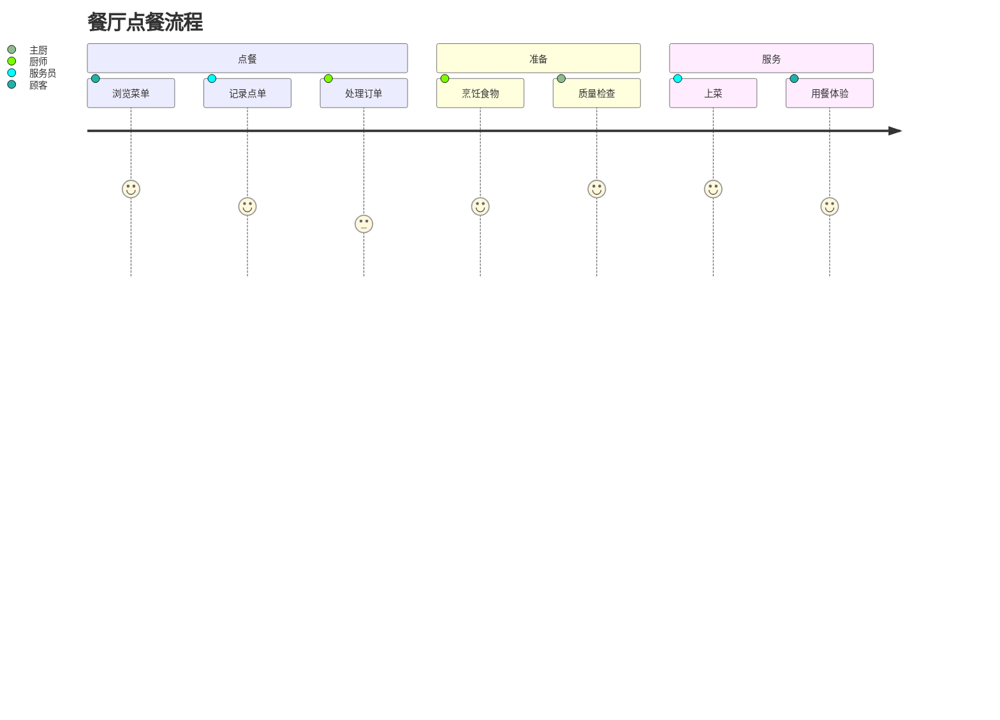

# 用户旅程图

用户旅程图帮助可视化和分析用户在流程或服务中的体验。它们非常适合用来映射客户交互并识别痛点。

## 语法

### 基本元素
- 标题: `journey title [旅程标题]`
- 部分: `section [部分名称]`
- 任务: `[任务名称]: [评分]: [角色]`
- 评分: 1-5分制（1最低，5最高）

## 基础示例

## 高级示例

这是一个展示完整电子商务体验的更复杂用户旅程：

## 评分系统

评分标准说明：
1. 非常不满意 😫
2. 不满意 😟
3. 一般 😐
4. 满意 😊
5. 非常满意 😄

## 多角色示例

## 样式设置

图表会自动：
- 为不同部分使用不同颜色
- 显示评分对应的表情
- 按时间顺序排列任务
- 将相关任务分组到部分中

## 实用技巧
- 保持部分名称清晰简洁
- 使用有意义的任务描述
- 基于实际用户反馈评分
- 包含所有关键接触点
- 考虑多个用户角色
- 从用户视角出发
- 使用部分来分组相关活动

## 常见问题解决

1. **结构问题**
   - 确保部分逻辑合理
   - 任务顺序正确
   - 角色分配适当

2. **评分问题**
   - 保持评分客观
   - 基于用户反馈
   - 定期更新评分

3. **可读性问题**
   - 使用简洁的描述
   - 避免过多部分
   - 保持任务数量合理

## 最佳实践
- 从用户视角设计旅程
- 识别关键接触点
- 突出痛点和机会
- 定期更新和优化
- 收集用户反馈
- 关注情感变化
- 保持图表简洁

## 下一步
- [甘特图](/zh/diagrams/gantt)
- [饼图](/zh/diagrams/pie)
- [Git图](/zh/diagrams/git) 