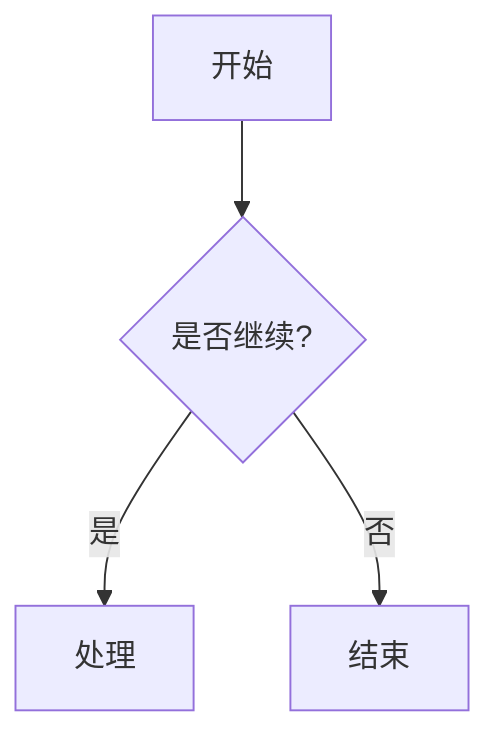
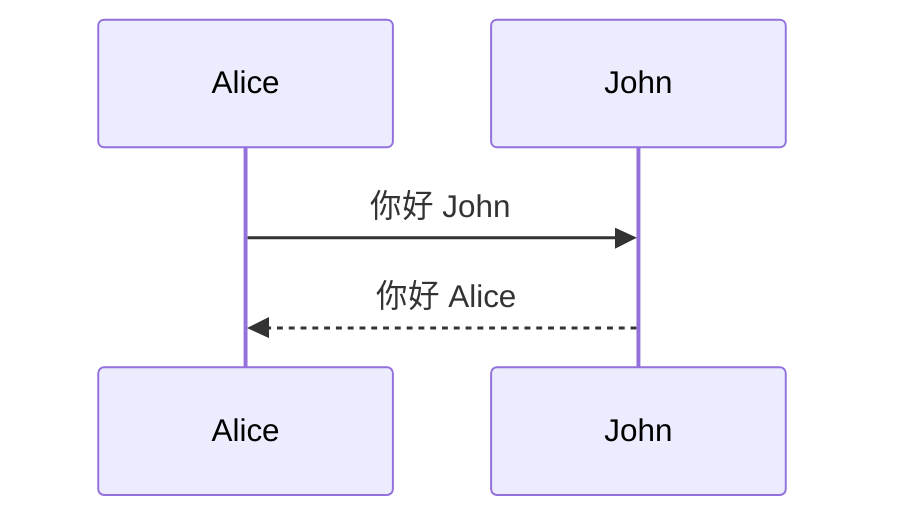
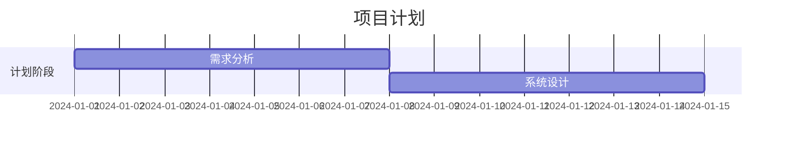

# 快速开始

本指南将帮助你快速上手使用 Mermaid 创建图表。

## 基本步骤

1. 访问 [Mermaid Viewer](https://mermaidviewer.com)
2. 选择一个图表类型
3. 编写图表代码
4. 实时预览结果

## 基本语法

所有的 Mermaid 图表都以声明图表类型开始，然后是具体的图表定义。

### 流程图示例



代码说明：
- `graph TD` 表示这是一个自上而下的图表
- 方括号 `[]` 创建矩形节点
- 花括号 `{}` 创建菱形节点
- `-->` 创建连接线
- `|文本|` 在连接线上添加文本

### 时序图示例



代码说明：
- `sequenceDiagram` 声明这是一个时序图
- `->>` 创建实线箭头
- `-->>` 创建虚线箭头

### 甘特图示例



代码说明：
- `gantt` 声明这是一个甘特图
- `dateFormat` 定义日期格式
- `section` 创建任务分组
- 任务定义包括名称、开始日期和持续时间

## 常用技巧

1. **注释**
   ```
   %% 这是注释
   ```

2. **样式**
   ```mermaid
   graph LR
      A[红色节点]
      style A fill:#f00
   ```

3. **子图**
   ```mermaid
   graph TB
      subgraph 子图标题
          A --> B
      end
   ```

## 集成方式

### Markdown 集成

在 Markdown 文件中使用：

    ```mermaid
    graph LR
        A --> B
    ```

### HTML 集成

在网页中嵌入：

```html
<div class="mermaid">
    graph LR
        A --> B
</div>
```

## 常见问题

1. **语法错误**
   - 检查括号是否配对
   - 确保箭头方向正确
   - 验证节点 ID 是否唯一

2. **布局问题**
   - 尝试调整图表方向（TD、LR 等）
   - 减少节点间的连接数量
   - 使用子图组织复杂图表

3. **渲染问题**
   - 确保使用最新版本的 Mermaid
   - 检查浏览器兼容性
   - 清除浏览器缓存

## 下一步

- [流程图详解](/zh/diagrams/flowchart)
- [时序图教程](/zh/diagrams/sequence)
- [完整图表类型列表](/zh/diagrams/overview)

## 在线资源

- [官方文档](https://mermaid.js.org/)
- [在线编辑器](/zh/mermaid-viewer/full-screen-editor)
- [示例库](/zh/examples) 