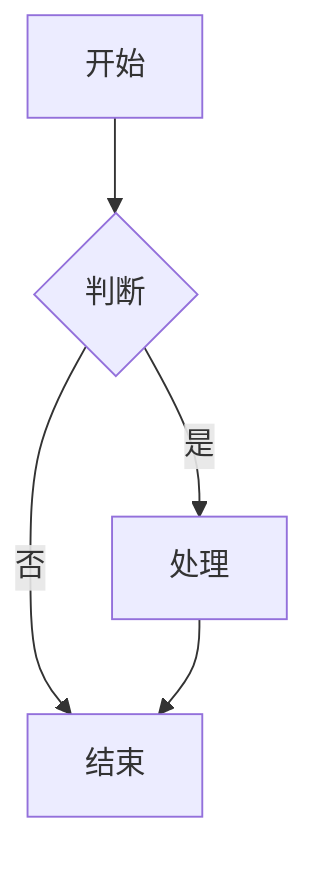
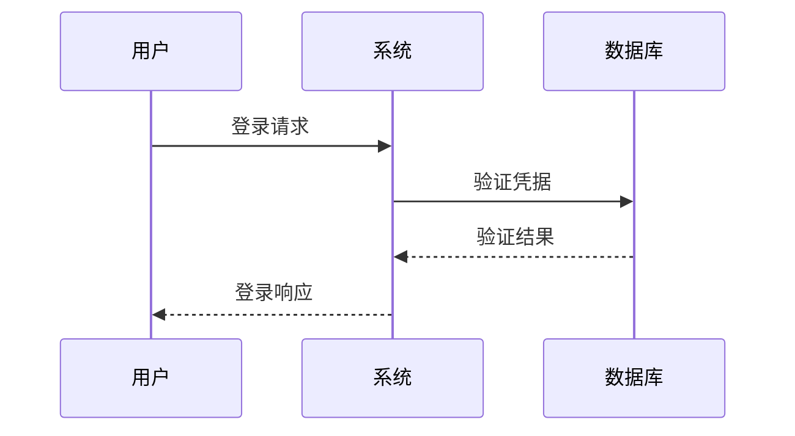
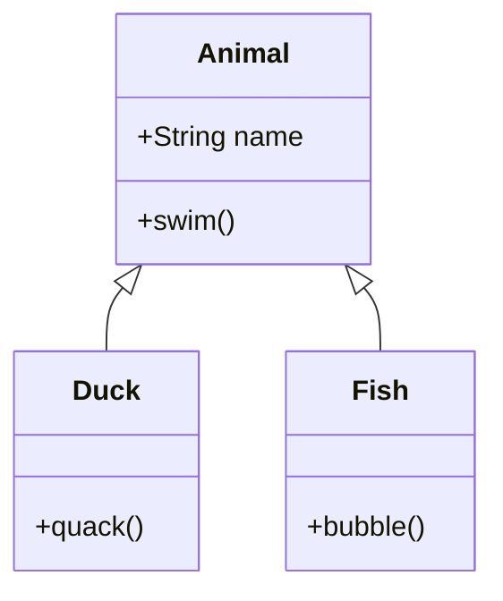

# 什么是 Mermaid？

Mermaid 是一个基于 JavaScript 的图表和可视化工具，它允许你使用文本和代码来创建图表。它的主要目标是帮助文档跟上开发的步伐。

## 主要特点

- 📝 使用文本定义图表
- 🔄 版本控制友好
- 🎨 多种图表类型支持
- 🛠 易于集成和使用
- 📱 响应式设计

## 支持的图表类型

### 流程图
流程图是最基本和最常用的图表类型之一：

### 时序图
用于展示对象或系统之间的交互：

### 类图
展示系统的静态结构：

## 为什么选择 Mermaid？

1. **简单易学**
   - 使用简单的文本语法
   - 丰富的文档和示例
   - 活跃的社区支持

2. **版本控制友好**
   - 图表定义以文本形式存储
   - 易于追踪变更
   - 支持团队协作

3. **多种集成选项**
   - 支持 Markdown 集成
   - 可以嵌入到各种平台
   - 提供 API 接口

4. **实时预览**
   - 即时查看修改效果
   - 快速迭代和调整
   - 所见即所得的编辑体验

## 开始使用

要开始使用 Mermaid，你可以：

1. 访问 [Mermaid Viewer](https://mermaidviewer.com)
2. 选择你想创建的图表类型
3. 使用提供的示例作为起点
4. 根据需要修改和调整

## 下一步

- [快速开始](/zh/introduction/getting-started) - 学习基本语法和使用方法
- [流程图](/zh/diagrams/flowchart) - 深入了解最常用的图表类型
- [在线编辑器](/zh/mermaid-viewer/live-editor) - 使用在线工具创建图表 