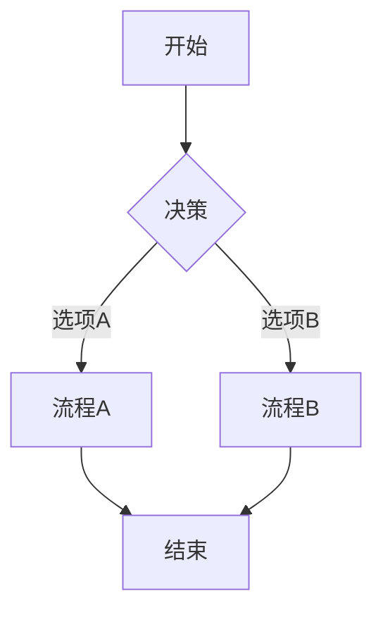

# Mermaid查看器使用指南

[Mermaid查看器](https://mermaidviewer.com)是一个功能强大且直观的图表编辑工具，只需三个简单步骤即可创建专业图表。

### 基本使用流程

#### 1. 输入Mermaid代码

在[Mermaid查看器](https://mermaidviewer.com)的编辑器窗格中输入图表代码。如果您是新手，可以使用默认示例代码作为起点：

编辑器支持语法高亮，可以帮助您更轻松地编写和管理代码。

#### 2. 实时预览

当您输入或修改代码时，右侧预览窗格会自动更新，实时显示图表的变化。这种即时反馈使您能够快速迭代和完善您的图表设计。

#### 3. 导出与分享

完成图表后，您可以：
- 导出为SVG格式（可缩放矢量图）
- 导出为PNG格式（光栅图像）
- 导出为PDF格式（打印文档）
- 创建分享链接，与团队成员协作

### 高级功能

#### 保存图表
图表会自动保存在浏览器的本地存储中，您可以随时返回继续编辑。您还可以使用分享功能创建永久链接。

#### 分享与协作
点击"分享"按钮生成一个唯一链接，团队成员可以通过此链接查看和编辑图表。所有更改都会实时同步，支持多人协作。

#### 嵌入到其他平台
生成的图表可以嵌入到网站、博客、文档或演示文稿中。系统提供多种嵌入代码格式：
- HTML嵌入代码
- Markdown代码
- 图片链接

### 常见问题解答

**问：如何保存图表？**  
答：图表可以通过多种方式保存：1) 导出为SVG/PNG文件 2) 复制共享链接 3) 保存到浏览器本地存储。编辑器会自动保存最新更改，所以您不会丢失任何工作内容。

**问：需要安装吗？**  
答：不需要！[Mermaid查看器](https://mermaidviewer.com)是基于浏览器的在线工具，无需安装。只需打开浏览器访问网站，即可开始创建图表。

**问：如何导出高质量图表？**  
答：我们提供多种导出选项：1) 可缩放的SVG格式 2) 即用型PNG格式 3) 高分辨率导出选项，确保在任何场景下图表都清晰可见。您还可以自定义导出设置，如大小和背景色等。

无论您是需要快速创建简单图表，还是制作复杂的技术文档，[Mermaid查看器](https://mermaidviewer.com)都能满足您的需求，帮助您以专业方式可视化想法。